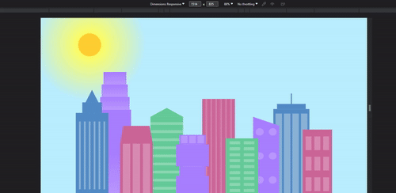

  

<h1 align="center">City Skyline Animation</h1>

Welcome to the City Skyline Animation project! This HTML and CSS code generates a visually appealing city skyline animation that adds a dynamic touch to your web page.

## Table of Contents

- [Introduction](#introduction)
- [Usage](#usage)
- [Customization](#customization)
- [License](#license)

## Introduction

The City Skyline Animation is a creative way to enhance the visual appeal of your web page by showcasing a dynamic city skyline. The animation is achieved using a combination of HTML and CSS, creating a captivating effect that can add character to your website.

## Usage

To add the City Skyline Animation to your web page:

1. Copy the HTML code provided in the snippet above.
2. Create a new HTML file or open an existing one in your preferred text editor.
3. Paste the copied code into the `<body>` section of your HTML file.
4. Save the file with an `.html` extension.
5. Create a new CSS file (e.g., `citySkyLine.css`) in the same directory as your HTML file.
6. Copy the CSS code for styling the animation and paste it into the newly created CSS file.
7. Save the CSS file.

Now, you can open the HTML file in a web browser to see the mesmerizing City Skyline Animation on your webpage!

## Customization

Feel free to customize the City Skyline Animation to match the look and feel of your website. You can adjust colors, sizes, and positioning in the CSS code to create a skyline that fits your design aesthetic.

## License

This project is provided under the [MIT License](LICENSE), allowing you to use and modify the code for personal and commercial projects. By using this code, you agree to comply with the terms of the license.

---

*Please note that this animation is meant for demonstration and educational purposes. You can build upon and modify the code to suit your needs and creative vision.*
